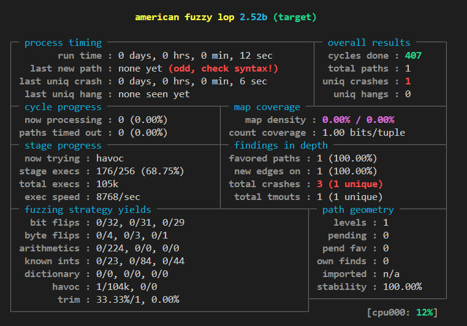

# AFL によるファジング入門

研究室セミナー用に作成した AFL (American Fuzzy Lop) によるファジング入門ハンズオン

> [!WARNING]
> ファジングは大量のデータを読み書きするため，メモリや CPU リソースを傷つける事で有名です．  
> Docker 上でやるので大丈夫だとは思いますが，ローカル環境で実施するのはオススメしません．

## 達成目標

- Docker や Linux コマンドに慣れよう
- 初歩的なバイナリ解析に触れよう
- ファジングについて理解しよう

## セットアップ

Dockerなどインストール

```sh
sudo apt-get update && sudo apt-get install -y gcc make docker docker-compose cmake
```

コンテナ立ち上げ

```sh
docker build . -t aflfuzz
docker run --privileged -it aflfuzz
```

## 前処理

```sh
afl-gcc src/target.c -o src/target
```

> [!NOTE]
> 脆弱性を含むバイナリをコンパイルするため，コンパイル時に warning が出るはずです．  
> これが正規の挙動なので，特に気にしないでください．  
> (コンパイル時に原因箇所は分かっても，どんな入力が危険なのかは分からないはずです)

また，コアダンプの出力先を明示する必要があるので以下のように設定します．

```sh
echo core >/proc/sys/kernel/core_pattern
```

## 実行

実行形式は以下の通り．

```sh
afl-fuzz -i <入力ディレクトリ> -o <出力ディレクトリ> <解析対象バイナリ>
```

入力ディレクトリには，`afl-2.52b` の `testcases/others/text` を用いる．  
出力ディレクトリは，適当に `out` ディレクトリを作っておく．

```sh
mkdir out
```

ここまで把握したら実行してみる

```sh
afl-fuzz -i ./afl-2.52b/testcases/others/text/ -o ./out ./src/target
```



永続的にファジングが実行されるので，適当なタイミングで `ctrl+c` で打ち切りましょう．

> [!NOTE]
> 上のような画面にならない時は，ターミナルの高さや幅が足りてないです．  
> 横か縦に広げてあげると正常に動作するはずです．  
> この現象は QEMU 等を動作させる際にも起きるので覚えておくと良いです．

> [!WARNING]
> `PROGRAM ABORT : Suboptimal CPU scaling governor` と出た場合，以下の設定を行ってください．  
> ```
> cd /sys/devices/system/cpu
> echo performance | tee cpu*/cpufreq/scaling_governor
> cd /home/afluser
> ```
> AFLの生成する短命プロセスの実行時間が不安定になる「周波数スケジューリング」が有効になっていることが原因です．  
> それを無効にするコマンドを叩いています．  

## ミニ課題

### 1-1

`out` ディレクトリにファジングの結果が出力されています．  
シェル操作を兼ねつつ，どんな入力を入れた際にクラッシュするのかを答えよ．  
また，実際にその文字を `target` に入力し，クラッシュすることを確認せよ．

また，余力があれば，このバイナリに含まれている脆弱性を調べよ．

> [!TIP]
> `afl-gcc` は `gcc` のラッパーなので，`gcc` で出来ることは大抵できます．  
> `gcc` でコンパイルしたバイナリと同じように実行できるので，  
> `./target` で動作させて入力を与えれば良いです．

### 1-2

`out` ディレクトリ内にある他の情報を 1 つ挙げ，それらについて調査せよ．  
情報によって使用するコマンドは異なるため，コマンドは各自で調べつつ，調査すること．

### 参考

- [https://www.ipa.go.jp/security/vuln/fuzzing/ug65p9000001986g-att/000081408.pdf](https://www.ipa.go.jp/security/vuln/fuzzing/ug65p9000001986g-att/000081408.pdf)


